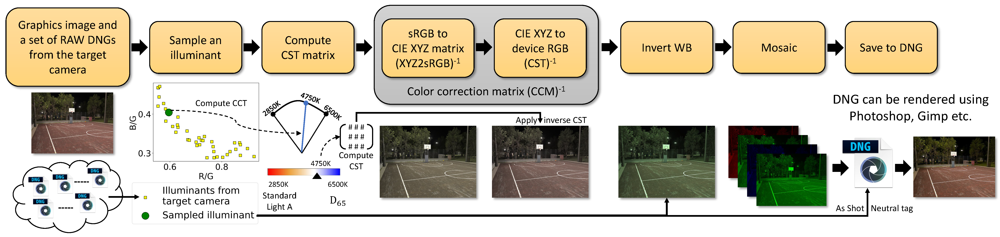

### Official repository for the paper
# Graphics2RAW: Mapping Computer Graphics Images to Sensor RAW Images @ICCV'23

Donghwan Seo, Abhijith Punnappurath, Luxi Zhao, Abdelrahman Abdelhamed, Sai Kiran Tedla, Sanguk Park, Jihwan Choe, and Michael S. Brown

#### Samsung Electronics, Samsung AI Center Toronto


[](https://openaccess.thecvf.com/content/ICCV2023/papers/Seo_Graphics2RAW_Mapping_Computer_Graphics_Images_to_Sensor_RAW_Images_ICCV_2023_paper.pdf)
[](https://openaccess.thecvf.com/content/ICCV2023/supplemental/Seo_Graphics2RAW_Mapping_Computer_ICCV_2023_supplemental.pdf)




## Getting Started
- The code was tested on Ubuntu 18.04, Python3.7, CUDA 11.3, cuDNN 8.2, Pytorch 1.10
- The code may work in other environments
- Install requirements
  ```
  pip install -r requirements.txt
  ```

### Dataset
Our graphics dataset can be downloaded from [here](https://sites.google.com/view/tedlasai/home/graphics2raw).

In addition to the full dataset, a small set of sample images is provided for a sneak peek.

### Convert graphics images to RAW images
```
python3 -m data_generation.package_exr_to_dng_graphics2raw --exr_folder_path path/to/graphics2RAW-dataset-samples --save_path path/to/outputs
```

## Downstream Tasks
Data generation, training and testing instructions for the downstream tasks:
- [Neural ISP](docs/neural_isp.md)
- [RAW Denoising](docs/raw_denoising.md)
- [Illumination Estimation](docs/illum_est.md)

## Citation

If you use this code or the associated data, please cite the paper:

```
@InProceedings{Seo_2023_ICCV,
    author    = {Seo, Donghwan and Punnappurath, Abhijith and Zhao, Luxi and Abdelhamed, Abdelrahman and Tedla, Sai Kiran and Park, Sanguk and Choe, Jihwan and Brown, Michael S.},
    title     = {Graphics2RAW: Mapping Computer Graphics Images to Sensor RAW Images},
    booktitle = {Proceedings of the IEEE/CVF International Conference on Computer Vision (ICCV)},
    month     = {October},
    year      = {2023},
    pages     = {12622-12631}
}
```

## Contact
- [Luxi Zhao](https://github.com/Luxi-Zhao) - [(lucy.zhao@samsung.com; lucyzhao.zlx@gmail.com)](mailto:lucy.zhao@samsung.com;lucyzhao.zlx@gmail.com)
- [Abhijith Punnappurath](https://abhijithpunnappurath.github.io/) - [(abhijith.p@samsung.com; jithuthatswho@gmail.com)](mailto:abhijith.p@samsung.com;jithuthatswho@gmail.com)
- [Donghwan Seo](https://github.com/ian-seo) - [(dong88.seo@samsung.com; dong88.seo@gmail.com)](mailto:dong88.seo@samsung.com;dong88.seo@gmail.com)
